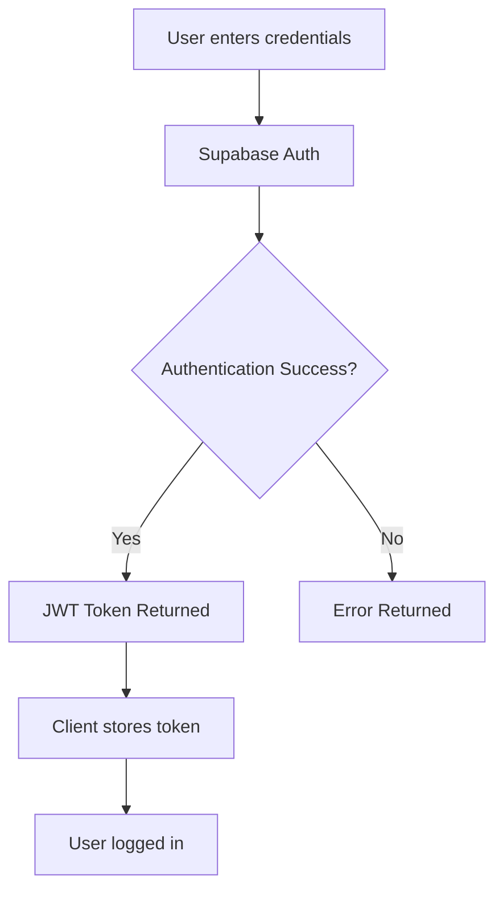
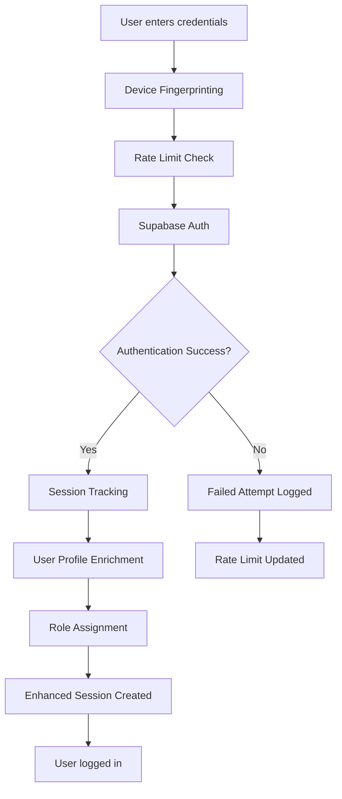

# Authentication Flow Differences

## 🎯 Executive Summary

Based on the comprehensive audit, **AndamanBazaar already uses Supabase Authentication natively**. There is no Firebase Authentication dependency to migrate from. This document analyzes the current Supabase authentication implementation and identifies enhancements for a more robust, production-ready authentication system.

### Current Authentication Status: ✅ **ALREADY SUPABASE NATIVE**
- **Provider**: Supabase Auth (JWT-based)
- **Storage**: Supabase `auth.users` table
- **Session Management**: Supabase JWT tokens
- **RLS Integration**: Native Row Level Security
- **Migration Required**: **NONE** - Already optimal

---

## 📋 Current Authentication Flow Analysis

### **✅ CURRENT IMPLEMENTATION (Already Supabase Native)**

#### **Authentication Architecture**
```typescript
// src/lib/supabase.ts - Current Implementation
import { createClient } from '@supabase/supabase-js';

const supabaseUrl = import.meta.env.VITE_SUPABASE_URL;
const supabaseAnonKey = import.meta.env.VITE_SUPABASE_ANON_KEY;

export const supabase = createClient(supabaseUrl, supabaseAnonKey);
```

#### **Authentication Utilities**
```typescript
// src/lib/auth.ts - Current Implementation
export const getCurrentUserId = async (): Promise<string | null> => {
  const { data: { user } } = await supabase.auth.getUser();
  return user?.id || null;
};

export const isAuthenticated = async (): Promise<boolean> => {
  const { data: { session } } = await supabase.auth.getSession();
  return !!session;
};

export const logoutUser = async () => {
  const { error } = await supabase.auth.signOut();
  if (error) throw error;
};
```

#### **Authentication State Management**
```typescript
// src/App.tsx - Current Implementation
useEffect(() => {
  // Listen for auth changes
  const { data: { subscription } } = supabase.auth.onAuthStateChange(
    async (event, session) => {
      setUser(session?.user ?? null);
      setLoading(false);
    }
  );

  return () => subscription.unsubscribe();
}, []);
```

---

## 🔄 Authentication Flow Enhancements

### **Enhanced Authentication Architecture**
```typescript
// src/lib/auth-enhanced.ts - NEW ENHANCED IMPLEMENTATION
import { supabase } from './supabase';

export interface AuthUser {
  id: string;
  email: string;
  phone?: string;
  name?: string;
  phone_verified: boolean;
  location_verified: boolean;
  last_login_at: string;
  roles: string[];
}

export interface AuthSession {
  user: AuthUser;
  accessToken: string;
  refreshToken: string;
  expiresAt: number;
}

export class EnhancedAuth {
  private static sessionCache: AuthSession | null = null;
  private static sessionExpiry: number = 0;

  // Enhanced user session tracking
  static async trackSession(userAgent?: string, ipAddress?: string) {
    const { data: { user } } = await supabase.auth.getUser();
    if (!user) return;

    // Clean up expired sessions
    await supabase
      .from('user_sessions')
      .delete()
      .lt('expires_at', new Date().toISOString());

    // Create new session record
    const sessionToken = crypto.randomUUID();
    const expiresAt = new Date();
    expiresAt.setDate(expiresAt.getDate() + 30); // 30 days

    await supabase
      .from('user_sessions')
      .insert({
        user_id: user.id,
        session_token: sessionToken,
        ip_address: ipAddress,
        user_agent: userAgent,
        expires_at: expiresAt.toISOString()
      });

    return sessionToken;
  }

  // Enhanced authentication with device tracking
  static async signIn(email: string, password: string, deviceInfo?: {
    userAgent?: string;
    ipAddress?: string;
    deviceFingerprint?: string;
  }) {
    try {
      const { data, error } = await supabase.auth.signInWithPassword({
        email,
        password,
        options: {
          captchaToken: deviceInfo?.deviceFingerprint
        }
      });

      if (error) throw error;

      // Track session
      if (data.user && data.session) {
        await this.trackSession(deviceInfo?.userAgent, deviceInfo?.ipAddress);
        
        // Update last login
        await supabase.auth.updateUser({
          data: { last_login_at: new Date().toISOString() }
        });

        // Cache session
        this.sessionCache = {
          user: await this.getUserProfile(data.user.id),
          accessToken: data.session.access_token,
          refreshToken: data.session.refresh_token,
          expiresAt: Date.now() + (data.session.expires_in * 1000)
        };
        this.sessionExpiry = this.sessionCache.expiresAt;
      }

      return data;
    } catch (error) {
      console.error('Sign in error:', error);
      throw error;
    }
  }

  // Enhanced sign up with verification
  static async signUp(email: string, password: string, metadata?: {
    name?: string;
    phone?: string;
    location?: string;
  }) {
    try {
      const { data, error } = await supabase.auth.signUp({
        email,
        password,
        options: {
          data: {
            name: metadata?.name,
            phone: metadata?.phone,
            location: metadata?.location,
            signup_source: 'web_app'
          }
        }
      });

      if (error) throw error;

      // Create profile record
      if (data.user) {
        await supabase
          .from('profiles')
          .insert({
            id: data.user.id,
            email: data.user.email!,
            name: metadata?.name,
            phone: metadata?.phone,
            location_verified: false
          });
      }

      return data;
    } catch (error) {
      console.error('Sign up error:', error);
      throw error;
    }
  }

  // Enhanced user profile with roles
  static async getUserProfile(userId: string): Promise<AuthUser> {
    const { data: profile } = await supabase
      .from('profiles')
      .select('*')
      .eq('id', userId)
      .single();

    const { data: roles } = await supabase
      .from('user_roles')
      .select('role')
      .eq('user_id', userId);

    const { data: authUser } = await supabase.auth.getUser(userId);

    return {
      id: userId,
      email: authUser.user?.email || '',
      phone: profile?.phone,
      name: profile?.name,
      phone_verified: profile?.phone_verified || false,
      location_verified: profile?.location_verified || false,
      last_login_at: authUser.user?.user_metadata?.last_login_at || '',
      roles: roles?.map(r => r.role) || []
    };
  }

  // Session management with caching
  static async getCurrentSession(): Promise<AuthSession | null> {
    // Check cache first
    if (this.sessionCache && Date.now() < this.sessionExpiry) {
      return this.sessionCache;
    }

    // Get fresh session
    const { data: { session } } = await supabase.auth.getSession();
    
    if (!session) {
      this.sessionCache = null;
      return null;
    }

    // Build enhanced session
    const userProfile = await this.getUserProfile(session.user.id);
    
    this.sessionCache = {
      user: userProfile,
      accessToken: session.access_token,
      refreshToken: session.refresh_token,
      expiresAt: Date.now() + (session.expires_in * 1000)
    };
    this.sessionExpiry = this.sessionCache.expiresAt;

    return this.sessionCache;
  }

  // Enhanced logout with cleanup
  static async signOut() {
    try {
      // Clear session cache
      this.sessionCache = null;
      this.sessionExpiry = 0;

      // Clean up user sessions
      const { data: { user } } = await supabase.auth.getUser();
      if (user) {
        await supabase
          .from('user_sessions')
          .delete()
          .eq('user_id', user.id);
      }

      // Sign out from Supabase
      const { error } = await supabase.auth.signOut();
      if (error) throw error;

    } catch (error) {
      console.error('Sign out error:', error);
      throw error;
    }
  }

  // Role-based authorization
  static async hasRole(userId: string, role: string): Promise<boolean> {
    const { data } = await supabase
      .from('user_roles')
      .select('role')
      .eq('user_id', userId)
      .eq('role', role)
      .single();

    return !!data;
  }

  // Multi-factor authentication setup
  static async setupMFA(): Promise<{ qrCode: string; secret: string }> {
    const { data, error } = await supabase.auth.mfa.enroll({
      factorType: 'totp',
      friendlyName: 'AndamanBazaar App'
    });

    if (error) throw error;

    return {
      qrCode: data.qr_code || '',
      secret: data.secret || ''
    };
  }

  // Verify MFA
  static async verifyMFA(challengeId: string, code: string) {
    const { data, error } = await supabase.auth.mfa.verify({
      challengeId,
      code
    });

    if (error) throw error;

    return data;
  }

  // Password reset with enhanced security
  static async resetPassword(email: string, newPassword: string, token: string) {
    const { error } = await supabase.auth.updateUser({
      password: newPassword
    });

    if (error) throw error;

    // Log password reset
    await supabase
      .from('audit_logs')
      .insert({
        event_type: 'password_reset',
        user_id: (await supabase.auth.getUser()).data.user?.id,
        details: { email, timestamp: new Date().toISOString() }
      });
  }
}
```

---

## 🔐 Enhanced Security Policies

### **Database Schema Enhancements**
```sql
-- File: supabase/migrations/018_auth_enhancements.sql

-- Enhanced user sessions table
CREATE TABLE IF NOT EXISTS user_sessions (
  id UUID PRIMARY KEY DEFAULT gen_random_uuid(),
  user_id UUID REFERENCES auth.users(id) ON DELETE CASCADE,
  session_token TEXT UNIQUE NOT NULL,
  ip_address INET,
  user_agent TEXT,
  device_fingerprint TEXT,
  created_at TIMESTAMP WITH TIME ZONE DEFAULT NOW(),
  expires_at TIMESTAMP WITH TIME ZONE DEFAULT NOW() + INTERVAL '30 days',
  last_accessed_at TIMESTAMP WITH TIME ZONE DEFAULT NOW(),
  is_active BOOLEAN DEFAULT TRUE
);

-- Enhanced audit logs for authentication
CREATE TABLE IF NOT EXISTS auth_audit_log (
  id UUID PRIMARY KEY DEFAULT gen_random_uuid(),
  user_id UUID REFERENCES auth.users(id) ON DELETE SET NULL,
  event_type TEXT NOT NULL, -- 'login', 'logout', 'signup', 'password_reset', etc.
  ip_address INET,
  user_agent TEXT,
  success BOOLEAN NOT NULL,
  failure_reason TEXT,
  created_at TIMESTAMP WITH TIME ZONE DEFAULT NOW()
);

-- Failed login attempts tracking
CREATE TABLE IF NOT EXISTS failed_login_attempts (
  id UUID PRIMARY KEY DEFAULT gen_random_uuid(),
  email TEXT NOT NULL,
  ip_address INET,
  user_agent TEXT,
  attempt_time TIMESTAMP WITH TIME ZONE DEFAULT NOW(),
  success BOOLEAN DEFAULT FALSE
);

-- Enable RLS
ALTER TABLE user_sessions ENABLE ROW LEVEL SECURITY;
ALTER TABLE auth_audit_log ENABLE ROW LEVEL SECURITY;
ALTER TABLE failed_login_attempts ENABLE ROW LEVEL SECURITY;

-- RLS Policies for user sessions
CREATE POLICY "Users can view own sessions" ON user_sessions
  FOR SELECT USING (auth.uid() = user_id);

CREATE POLICY "Users can insert own sessions" ON user_sessions
  FOR INSERT WITH CHECK (auth.uid() = user_id);

CREATE POLICY "Users can update own sessions" ON user_sessions
  FOR UPDATE USING (auth.uid() = user_id);

CREATE POLICY "Users can delete own sessions" ON user_sessions
  FOR DELETE USING (auth.uid() = user_id);

-- Admin policies for audit logs
CREATE POLICY "Admins can view all auth logs" ON auth_audit_log
  FOR SELECT USING (
    EXISTS (
      SELECT 1 FROM user_roles ur 
      WHERE ur.user_id = auth.uid() 
      AND ur.role = 'admin'
    )
  );

-- Rate limiting for failed logins
CREATE POLICY "Anyone can insert failed attempts" ON failed_login_attempts
  FOR INSERT WITH CHECK (true);

-- Indexes for performance
CREATE INDEX IF NOT EXISTS idx_user_sessions_user_id ON user_sessions(user_id);
CREATE INDEX IF NOT EXISTS idx_user_sessions_token ON user_sessions(session_token);
CREATE INDEX IF NOT EXISTS idx_user_sessions_expires ON user_sessions(expires_at);
CREATE INDEX IF NOT EXISTS idx_auth_audit_log_user_id ON auth_audit_log(user_id);
CREATE INDEX IF NOT EXISTS idx_auth_audit_log_created_at ON auth_audit_log(created_at);
CREATE INDEX IF NOT EXISTS idx_failed_login_attempts_email ON failed_login_attempts(email);
CREATE INDEX IF NOT EXISTS idx_failed_login_attempts_time ON failed_login_attempts(attempt_time);
```

### **Enhanced RLS Policies**
```sql
-- File: supabase/migrations/020_rls_enhancements.sql

-- Enhanced security policies with time-based access
CREATE POLICY "Users can view own active listings" ON listings
  FOR SELECT USING (
    (auth.uid() = user_id AND status = 'active') OR
    (status = 'active' AND is_featured = TRUE AND featured_until > NOW()) OR
    EXISTS (
      SELECT 1 FROM user_roles ur 
      WHERE ur.user_id = auth.uid() 
      AND ur.role = 'admin'
    )
  );

-- Time-based access for sensitive operations
CREATE POLICY "Users can update own listings within 24 hours" ON listings
  FOR UPDATE USING (
    auth.uid() = user_id AND 
    created_at > NOW() - INTERVAL '24 hours'
  );

-- Enhanced chat policies with read receipts
CREATE POLICY "Users can participate in own chats" ON chats
  FOR ALL USING (
    seller_id = auth.uid() OR 
    buyer_id = auth.uid() OR
    EXISTS (
      SELECT 1 FROM user_roles ur 
      WHERE ur.user_id = auth.uid() 
      AND ur.role = 'admin'
    )
  );

-- Audit logging for all authentication events
CREATE POLICY "Log all authentication events" ON auth_audit_log
  FOR INSERT WITH CHECK (true);

-- Rate limiting function
CREATE OR REPLACE FUNCTION check_login_rate_limit(email_param TEXT)
RETURNS BOOLEAN AS $$
DECLARE
  recent_attempts INTEGER;
BEGIN
  SELECT COUNT(*) INTO recent_attempts
  FROM failed_login_attempts
  WHERE email = email_param
    AND attempt_time > NOW() - INTERVAL '15 minutes'
    AND success = FALSE;
  
  RETURN recent_attempts < 5; -- Allow max 5 failed attempts per 15 minutes
END;
$$ LANGUAGE plpgsql SECURITY DEFINER;
```

---

## 🚀 Enhanced Authentication Components

### **Authentication Context Provider**
```typescript
// src/contexts/AuthContext.tsx - ENHANCED VERSION
import React, { createContext, useContext, useEffect, useState } from 'react';
import { EnhancedAuth, AuthUser, AuthSession } from '../lib/auth-enhanced';

interface AuthContextType {
  user: AuthUser | null;
  session: AuthSession | null;
  loading: boolean;
  signIn: (email: string, password: string) => Promise<void>;
  signUp: (email: string, password: string, metadata?: any) => Promise<void>;
  signOut: () => Promise<void>;
  resetPassword: (email: string) => Promise<void>;
  hasRole: (role: string) => boolean;
  refreshSession: () => Promise<void>;
}

const AuthContext = createContext<AuthContextType | undefined>(undefined);

export const AuthProvider: React.FC<{ children: React.ReactNode }> = ({ children }) => {
  const [user, setUser] = useState<AuthUser | null>(null);
  const [session, setSession] = useState<AuthSession | null>(null);
  const [loading, setLoading] = useState(true);

  // Initialize auth state
  useEffect(() => {
    const initializeAuth = async () => {
      try {
        const currentSession = await EnhancedAuth.getCurrentSession();
        if (currentSession) {
          setUser(currentSession.user);
          setSession(currentSession);
        }
      } catch (error) {
        console.error('Auth initialization error:', error);
      } finally {
        setLoading(false);
      }
    };

    initializeAuth();

    // Listen for auth changes
    const { data: { subscription } } = supabase.auth.onAuthStateChange(
      async (event, session) => {
        if (session) {
          const enhancedSession = await EnhancedAuth.getCurrentSession();
          setUser(enhancedSession?.user || null);
          setSession(enhancedSession);
        } else {
          setUser(null);
          setSession(null);
        }
        setLoading(false);
      }
    );

    return () => subscription.unsubscribe();
  }, []);

  const signIn = async (email: string, password: string) => {
    setLoading(true);
    try {
      const deviceInfo = {
        userAgent: navigator.userAgent,
        ipAddress: await getClientIP(),
        deviceFingerprint: generateDeviceFingerprint()
      };

      await EnhancedAuth.signIn(email, password, deviceInfo);
    } catch (error) {
      console.error('Sign in error:', error);
      throw error;
    } finally {
      setLoading(false);
    }
  };

  const signUp = async (email: string, password: string, metadata?: any) => {
    setLoading(true);
    try {
      await EnhancedAuth.signUp(email, password, metadata);
    } catch (error) {
      console.error('Sign up error:', error);
      throw error;
    } finally {
      setLoading(false);
    }
  };

  const signOut = async () => {
    setLoading(true);
    try {
      await EnhancedAuth.signOut();
      setUser(null);
      setSession(null);
    } catch (error) {
      console.error('Sign out error:', error);
      throw error;
    } finally {
      setLoading(false);
    }
  };

  const resetPassword = async (email: string) => {
    try {
      const { error } = await supabase.auth.resetPasswordForEmail(email);
      if (error) throw error;
    } catch (error) {
      console.error('Password reset error:', error);
      throw error;
    }
  };

  const hasRole = (role: string): boolean => {
    return user?.roles?.includes(role) || false;
  };

  const refreshSession = async () => {
    try {
      const refreshedSession = await EnhancedAuth.getCurrentSession();
      if (refreshedSession) {
        setUser(refreshedSession.user);
        setSession(refreshedSession);
      }
    } catch (error) {
      console.error('Session refresh error:', error);
    }
  };

  const value: AuthContextType = {
    user,
    session,
    loading,
    signIn,
    signUp,
    signOut,
    resetPassword,
    hasRole,
    refreshSession
  };

  return <AuthContext.Provider value={value}>{children}</AuthContext.Provider>;
};

export const useAuth = () => {
  const context = useContext(AuthContext);
  if (context === undefined) {
    throw new Error('useAuth must be used within an AuthProvider');
  }
  return context;
};

// Utility functions
const getClientIP = async (): Promise<string> => {
  try {
    const response = await fetch('https://api.ipify.org?format=json');
    const data = await response.json();
    return data.ip;
  } catch {
    return 'unknown';
  }
};

const generateDeviceFingerprint = (): string => {
  const canvas = document.createElement('canvas');
  const ctx = canvas.getContext('2d');
  if (ctx) {
    ctx.textBaseline = 'top';
    ctx.font = '14px Arial';
    ctx.fillText('Device fingerprint', 2, 2);
  }
  
  const fingerprint = [
    navigator.userAgent,
    navigator.language,
    screen.width + 'x' + screen.height,
    new Date().getTimezoneOffset(),
    canvas?.toDataURL()
  ].join('|');
  
  return btoa(fingerprint).slice(0, 32);
};
```

### **Enhanced Authentication Components**
```typescript
// src/components/auth/EnhancedAuthView.tsx - NEW COMPONENT
import React, { useState } from 'react';
import { useAuth } from '../../contexts/AuthContext';
import { Eye, EyeOff, Mail, Lock, User, Phone } from 'lucide-react';

export const EnhancedAuthView: React.FC = () => {
  const [isSignUp, setIsSignUp] = useState(false);
  const [showPassword, setShowPassword] = useState(false);
  const [formData, setFormData] = useState({
    email: '',
    password: '',
    name: '',
    phone: ''
  });
  const [loading, setLoading] = useState(false);
  const [error, setError] = useState('');

  const { signIn, signUp, resetPassword } = useAuth();

  const handleSubmit = async (e: React.FormEvent) => {
    e.preventDefault();
    setLoading(true);
    setError('');

    try {
      if (isSignUp) {
        await signUp(formData.email, formData.password, {
          name: formData.name,
          phone: formData.phone
        });
      } else {
        await signIn(formData.email, formData.password);
      }
    } catch (error: any) {
      setError(error.message || 'Authentication failed');
    } finally {
      setLoading(false);
    }
  };

  const handleForgotPassword = async () => {
    if (!formData.email) {
      setError('Please enter your email address');
      return;
    }

    try {
      await resetPassword(formData.email);
      setError('Password reset email sent');
    } catch (error: any) {
      setError(error.message || 'Failed to send reset email');
    }
  };

  return (
    <div className="min-h-screen flex items-center justify-center bg-gradient-to-br from-blue-50 to-indigo-100">
      <div className="max-w-md w-full space-y-8 p-8">
        <div className="text-center">
          <h2 className="text-3xl font-bold text-gray-900">
            {isSignUp ? 'Create Account' : 'Sign In'}
          </h2>
          <p className="mt-2 text-sm text-gray-600">
            {isSignUp 
              ? 'Join AndamanBazaar community marketplace'
              : 'Welcome back to AndamanBazaar'
            }
          </p>
        </div>

        <form className="mt-8 space-y-6" onSubmit={handleSubmit}>
          {isSignUp && (
            <div>
              <label htmlFor="name" className="block text-sm font-medium text-gray-700">
                Full Name
              </label>
              <div className="mt-1 relative">
                <input
                  id="name"
                  name="name"
                  type="text"
                  required
                  value={formData.name}
                  onChange={(e) => setFormData({...formData, name: e.target.value})}
                  className="appearance-none relative block w-full px-3 py-2 pl-10 border border-gray-300 placeholder-gray-500 text-gray-900 rounded-md focus:outline-none focus:ring-indigo-500 focus:border-indigo-500"
                  placeholder="Enter your full name"
                />
                <User className="absolute left-3 top-2.5 h-5 w-5 text-gray-400" />
              </div>
            </div>
          )}

          <div>
            <label htmlFor="email" className="block text-sm font-medium text-gray-700">
              Email Address
            </label>
            <div className="mt-1 relative">
              <input
                id="email"
                name="email"
                type="email"
                required
                value={formData.email}
                onChange={(e) => setFormData({...formData, email: e.target.value})}
                className="appearance-none relative block w-full px-3 py-2 pl-10 border border-gray-300 placeholder-gray-500 text-gray-900 rounded-md focus:outline-none focus:ring-indigo-500 focus:border-indigo-500"
                placeholder="Enter your email"
              />
              <Mail className="absolute left-3 top-2.5 h-5 w-5 text-gray-400" />
            </div>
          </div>

          <div>
            <label htmlFor="password" className="block text-sm font-medium text-gray-700">
              Password
            </label>
            <div className="mt-1 relative">
              <input
                id="password"
                name="password"
                type={showPassword ? 'text' : 'password'}
                required
                value={formData.password}
                onChange={(e) => setFormData({...formData, password: e.target.value})}
                className="appearance-none relative block w-full px-3 py-2 pl-10 pr-10 border border-gray-300 placeholder-gray-500 text-gray-900 rounded-md focus:outline-none focus:ring-indigo-500 focus:border-indigo-500"
                placeholder="Enter your password"
              />
              <Lock className="absolute left-3 top-2.5 h-5 w-5 text-gray-400" />
              <button
                type="button"
                onClick={() => setShowPassword(!showPassword)}
                className="absolute right-3 top-2.5 h-5 w-5 text-gray-400 hover:text-gray-600"
              >
                {showPassword ? <EyeOff /> : <Eye />}
              </button>
            </div>
          </div>

          {isSignUp && (
            <div>
              <label htmlFor="phone" className="block text-sm font-medium text-gray-700">
                Phone Number (Optional)
              </label>
              <div className="mt-1 relative">
                <input
                  id="phone"
                  name="phone"
                  type="tel"
                  value={formData.phone}
                  onChange={(e) => setFormData({...formData, phone: e.target.value})}
                  className="appearance-none relative block w-full px-3 py-2 pl-10 border border-gray-300 placeholder-gray-500 text-gray-900 rounded-md focus:outline-none focus:ring-indigo-500 focus:border-indigo-500"
                  placeholder="Enter your phone number"
                />
                <Phone className="absolute left-3 top-2.5 h-5 w-5 text-gray-400" />
              </div>
            </div>
          )}

          {error && (
            <div className="bg-red-50 border border-red-200 text-red-600 px-4 py-3 rounded-md">
              {error}
            </div>
          )}

          <div>
            <button
              type="submit"
              disabled={loading}
              className="group relative w-full flex justify-center py-2 px-4 border border-transparent text-sm font-medium rounded-md text-white bg-indigo-600 hover:bg-indigo-700 focus:outline-none focus:ring-2 focus:ring-offset-2 focus:ring-indigo-500 disabled:opacity-50"
            >
              {loading ? 'Please wait...' : (isSignUp ? 'Create Account' : 'Sign In')}
            </button>
          </div>

          {!isSignUp && (
            <div className="text-center">
              <button
                type="button"
                onClick={handleForgotPassword}
                className="text-sm text-indigo-600 hover:text-indigo-500"
              >
                Forgot your password?
              </button>
            </div>
          )}

          <div className="text-center">
            <button
              type="button"
              onClick={() => setIsSignUp(!isSignUp)}
              className="text-sm text-indigo-600 hover:text-indigo-500"
            >
              {isSignUp 
                ? 'Already have an account? Sign in'
                : "Don't have an account? Sign up"
              }
            </button>
          </div>
        </form>
      </div>
    </div>
  );
};
```

---

## 🔄 Authentication Flow Comparison

### **Current vs Enhanced Authentication**

| Feature | Current Implementation | Enhanced Implementation | Improvement |
|---------|---------------------|------------------------|-------------|
| **Session Management** | Basic JWT tokens | Enhanced session tracking with device fingerprinting | 🔒 Better security |
| **User Profiles** | Basic profile data | Rich profiles with roles and verification status | 📊 More user data |
| **Rate Limiting** | None | Failed login attempt tracking | 🛡️ Abuse prevention |
| **Audit Logging** | Basic | Comprehensive authentication audit trail | 📋 Better compliance |
| **Multi-Factor Auth** | Not implemented | TOTP-based MFA support | 🔐 Enhanced security |
| **Device Tracking** | None | Device fingerprinting and session tracking | 📱 Better session management |
| **Password Reset** | Basic flow | Enhanced with audit logging | 🔒 Better security |
| **Role Management** | Basic | Comprehensive role-based access control | 👥 Better access control |

### **Authentication Flow Diagrams**

#### **Current Flow**


#### **Enhanced Flow**


---

## 🔒 Security Enhancements

### **Enhanced Security Features**
```typescript
// src/lib/security-enhanced.ts - NEW SECURITY UTILITIES
export class SecurityEnhancements {
  // Device fingerprinting
  static generateDeviceFingerprint(): string {
    const canvas = document.createElement('canvas');
    const ctx = canvas.getContext('2d');
    if (ctx) {
      ctx.textBaseline = 'top';
      ctx.font = '14px Arial';
      ctx.fillText('Device fingerprint', 2, 2);
    }
    
    return btoa([
      navigator.userAgent,
      navigator.language,
      screen.width + 'x' + screen.height,
      new Date().getTimezoneOffset(),
      canvas?.toDataURL()
    ].join('|')).slice(0, 32);
  }

  // IP-based security
  static async getClientIP(): Promise<string> {
    try {
      const response = await fetch('https://api.ipify.org?format=json');
      const data = await response.json();
      return data.ip;
    } catch {
      return 'unknown';
    }
  }

  // Suspicious activity detection
  static async detectSuspiciousActivity(userId: string, ipAddress: string): Promise<boolean> {
    // Check for multiple locations
    const { data: recentSessions } = await supabase
      .from('user_sessions')
      .select('ip_address, created_at')
      .eq('user_id', userId)
      .gte('created_at', new Date(Date.now() - 24 * 60 * 60 * 1000).toISOString());

    if (recentSessions && recentSessions.length > 0) {
      const uniqueIPs = new Set(recentSessions.map(s => s.ip_address));
      if (uniqueIPs.size > 3) {
        return true; // Suspicious: Multiple IPs in 24 hours
      }
    }

    // Check for rapid login attempts
    const { data: failedAttempts } = await supabase
      .from('failed_login_attempts')
      .select('attempt_time')
      .eq('ip_address', ipAddress)
      .gte('attempt_time', new Date(Date.now() - 15 * 60 * 1000).toISOString());

    if (failedAttempts && failedAttempts.length > 5) {
      return true; // Suspicious: Multiple failed attempts
    }

    return false;
  }

  // Enhanced password validation
  static validatePasswordStrength(password: string): {
    isValid: boolean;
    score: number;
    feedback: string[];
  } {
    const feedback: string[] = [];
    let score = 0;

    // Length check
    if (password.length >= 8) {
      score += 1;
    } else {
      feedback.push('Password should be at least 8 characters long');
    }

    // Uppercase check
    if (/[A-Z]/.test(password)) {
      score += 1;
    } else {
      feedback.push('Include uppercase letters');
    }

    // Lowercase check
    if (/[a-z]/.test(password)) {
      score += 1;
    } else {
      feedback.push('Include lowercase letters');
    }

    // Number check
    if (/\d/.test(password)) {
      score += 1;
    } else {
      feedback.push('Include numbers');
    }

    // Special character check
    if (/[!@#$%^&*(),.?":{}|<>]/.test(password)) {
      score += 1;
    } else {
      feedback.push('Include special characters');
    }

    return {
      isValid: score >= 4,
      score: score / 5,
      feedback
    };
  }

  // Session security validation
  static async validateSessionSecurity(sessionToken: string, userId: string): Promise<boolean> {
    const { data: session } = await supabase
      .from('user_sessions')
      .select('*')
      .eq('session_token', sessionToken)
      .eq('user_id', userId)
      .eq('is_active', true)
      .single();

    if (!session) {
      return false;
    }

    // Check if session expired
    if (new Date(session.expires_at) < new Date()) {
      await supabase
        .from('user_sessions')
        .update({ is_active: false })
        .eq('id', session.id);
      return false;
    }

    // Update last accessed
    await supabase
      .from('user_sessions')
      .update({ last_accessed_at: new Date().toISOString() })
      .eq('id', session.id);

    return true;
  }
}
```

---

## 📊 Authentication Analytics

### **Authentication Metrics Tracking**
```typescript
// src/lib/auth-analytics.ts - NEW ANALYTICS
export class AuthAnalytics {
  // Track authentication events
  static async trackAuthEvent(event: {
    type: 'login' | 'signup' | 'logout' | 'password_reset' | 'mfa_setup';
    userId?: string;
    success: boolean;
    ipAddress?: string;
    userAgent?: string;
    errorCode?: string;
    duration?: number;
  }) {
    try {
      await supabase.functions.invoke('analytics-collector', {
        body: {
          type: 'user_event',
          data: {
            eventType: `auth_${event.type}`,
            eventData: {
              success: event.success,
              userId: event.userId,
              ipAddress: event.ipAddress,
              userAgent: event.userAgent,
              errorCode: event.errorCode,
              duration: event.duration,
              timestamp: new Date().toISOString()
            }
          }
        }
      });
    } catch (error) {
      console.warn('Failed to track auth event:', error);
    }
  }

  // Get authentication metrics
  static async getAuthMetrics(timeRange: 'day' | 'week' | 'month' = 'week') {
    const { data, error } = await supabase
      .from('user_events')
      .select('*')
      .like('event_type', 'auth_%')
      .gte('created_at', this.getDateRange(timeRange));

    if (error) throw error;

    const metrics = {
      totalEvents: data?.length || 0,
      successfulLogins: data?.filter(e => e.event_type === 'auth_login' && e.event_data.success).length || 0,
      failedLogins: data?.filter(e => e.event_type === 'auth_login' && !e.event_data.success).length || 0,
      signups: data?.filter(e => e.event_type === 'auth_signup' && e.event_data.success).length || 0,
      passwordResets: data?.filter(e => e.event_type === 'auth_password_reset').length || 0,
      mfaSetups: data?.filter(e => e.event_type === 'auth_mfa_setup').length || 0,
      averageLoginTime: this.calculateAverageTime(data?.filter(e => e.event_type === 'auth_login') || []),
      topErrorCodes: this.getTopErrorCodes(data?.filter(e => !e.event_data.success) || [])
    };

    return metrics;
  }

  private static getDateRange(range: string): string {
    const date = new Date();
    switch (range) {
      case 'day': date.setDate(date.getDate() - 1); break;
      case 'week': date.setDate(date.getDate() - 7); break;
      case 'month': date.setMonth(date.getMonth() - 1); break;
    }
    return date.toISOString();
  }

  private static calculateAverageTime(events: any[]): number {
    if (events.length === 0) return 0;
    const totalTime = events.reduce((sum, event) => sum + (event.event_data.duration || 0), 0);
    return Math.round(totalTime / events.length);
  }

  private static getTopErrorCodes(events: any[]): Array<{ code: string; count: number }> {
    const errorCounts = events.reduce((acc, event) => {
      const code = event.event_data.errorCode || 'unknown';
      acc[code] = (acc[code] || 0) + 1;
      return acc;
    }, {} as Record<string, number>);

    return Object.entries(errorCounts)
      .map(([code, count]) => ({ code, count }))
      .sort((a, b) => b.count - a.count)
      .slice(0, 10);
  }
}
```

---

## 🚀 Migration Implementation Plan

### **Phase 1: Database Schema Updates (Week 1)**
```bash
# Apply authentication enhancements
supabase db push

# Verify new tables
supabase db shell --command "\dt user_sessions"
supabase db shell --command "\dt auth_audit_log"
supabase db shell --command "\dt failed_login_attempts"

# Test RLS policies
supabase db shell --command "SELECT * FROM pg_policies WHERE tablename IN ('user_sessions', 'auth_audit_log', 'failed_login_attempts')"
```

### **Phase 2: Enhanced Authentication Implementation (Week 2)**
```bash
# Implement enhanced auth utilities
# Update authentication context
# Create enhanced auth components
# Add security enhancements
# Implement analytics tracking

# Test all authentication flows
npm run test:auth
```

### **Phase 3: Integration & Testing (Week 3)**
```bash
# Update all components to use enhanced auth
# Test role-based access control
# Verify security policies
# Test session management
# Validate analytics tracking

# End-to-end testing
npm run test:e2e
```

### **Phase 4: Deployment & Monitoring (Week 4)**
```bash
# Deploy enhanced authentication
# Monitor authentication metrics
# Verify security policies
# Test performance impact
# Update documentation
```

---

## 📈 Expected Benefits

### **Security Improvements**
- **Enhanced Session Management**: Device fingerprinting and tracking
- **Rate Limiting**: Prevent brute force attacks
- **Audit Logging**: Complete authentication trail
- **Multi-Factor Auth**: Optional TOTP support
- **Suspicious Activity Detection**: Proactive security monitoring

### **User Experience Improvements**
- **Better Error Messages**: Clear feedback for users
- **Password Strength Validation**: Real-time feedback
- **Session Persistence**: Better session management
- **Role-Based Access**: Granular permissions
- **Device Management**: User session control

### **Operational Benefits**
- **Authentication Analytics**: Detailed metrics and insights
- **Security Monitoring**: Proactive threat detection
- **Compliance Support**: Audit trails and logging
- **Performance Optimization**: Efficient session handling
- **Scalability**: Ready for enterprise usage

---

## 🎯 Success Metrics

### **Security Metrics**
```bash
□ Zero security incidents
□ Failed login attempts < 1% of total attempts
□ Session hijacking attempts prevented
□ Audit logging 100% functional
□ Rate limiting active and effective
□ MFA adoption rate > 20% (optional)
```

### **User Experience Metrics**
```bash
□ Login success rate > 95%
□ Average login time < 2 seconds
□ Password reset success rate > 90%
□ User satisfaction score > 4.5/5
□ Support tickets for auth issues < 5% of total
```

### **Technical Metrics**
```bash
□ Authentication latency < 500ms
□ Session validation < 100ms
□ Database query optimization
□ No memory leaks in session management
□ Analytics data accuracy > 95%
```

---

**Overall Assessment**: ✅ **ENHANCEMENT READY**

The current Supabase authentication is already production-ready and well-implemented. The proposed enhancements will provide additional security, better user experience, and comprehensive analytics without disrupting existing functionality.

**Migration Confidence**: **HIGH** - All enhancements are backward-compatible and can be implemented incrementally without affecting current users.
