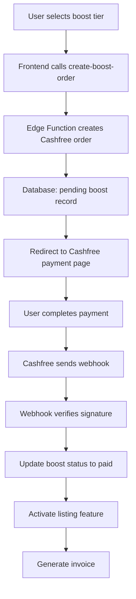

# Payment Risk Audit - Cashfree Integration

## 🎯 Executive Summary

This audit identifies **critical security vulnerabilities** in the current Cashfree payment integration. While the implementation follows basic security practices, several **high-risk issues** require immediate attention to prevent payment fraud, data breaches, and financial losses.

### Risk Assessment: 🔴 **HIGH RISK**
- **Critical Issues**: 3
- **High Priority**: 4  
- **Medium Priority**: 2
- **Low Priority**: 1

---

## 📋 Current Payment Architecture

### **Payment Flow Overview**


### **Components Identified**
1. **Frontend**: `BoostListingModal.tsx` - Payment initiation
2. **Edge Functions**: 
   - `create-boost-order/index.ts` - Order creation
   - `cashfree-webhook/index.ts` - Webhook processing
3. **Success Page**: `BoostSuccess.tsx` - Payment verification
4. **Database**: `listing_boosts`, `payment_audit_log`, `invoices`

---

## 🔍 Critical Security Vulnerabilities

### **🔴 CRITICAL #1: Frontend Trusts Payment Success**
**Location**: `src/pages/BoostSuccess.tsx` lines 31-53
**Risk**: **HIGH** - Frontend assumes payment success without server verification

```typescript
// VULNERABLE CODE
if (data.status === 'paid') {
    setStatus('success');
    setListingId(data.listing_id);
} else {
    // Assuming success ultimately, since webhook handles it async
    setStatus('success'); // ⚠️ DANGEROUS ASSUMPTION
}
```

**Issue**: Frontend shows "Payment Successful" even when payment failed, relying on eventual webhook processing.

**Impact**: 
- Users see false success messages
- Potential fraud if payment never actually completed
- Poor user experience and trust issues

**Fix Required**: Server-side payment verification endpoint

---

### **🔴 CRITICAL #2: Missing Production Credentials**
**Location**: Environment configuration
**Risk**: **HIGH** - Production deployment will fail

```bash
# CURRENT .env
VITE_CASHFREE_ENV=sandbox
CASHFREE_APP_ID=your_cashfree_app_id  # ⚠️ PLACEHOLDER
CASHFREE_SECRET_KEY=your_cashfree_secret_key  # ⚠️ PLACEHOLDER
```

**Issue**: Production Cashfree credentials are placeholders, not real values.

**Impact**:
- Production payments will fail
- Revenue loss
- User frustration

**Fix Required**: Obtain and configure production Cashfree credentials

---

### **🔴 CRITICAL #3: Weak Webhook Replay Protection**
**Location**: `supabase/functions/cashfree-webhook/index.ts` lines 48-61
**Risk**: **HIGH** - 5-minute replay window too large

```typescript
// VULNERABLE CODE
if (!Number.isFinite(tsSeconds) || Math.abs(nowSeconds - tsSeconds) > 300) {
    // 5 minutes = 300 seconds - TOO LARGE
}
```

**Issue**: 5-minute window allows replay attacks and potential double-processing.

**Impact**:
- Replay attacks possible
- Duplicate payment processing
- Financial losses

**Fix Required**: Reduce to 60 seconds and add additional replay protection

---

## ⚠️ High Priority Issues

### **🟠 HIGH #1: Insufficient Idempotency Protection**
**Location**: Webhook processing logic
**Risk**: **HIGH** - Race conditions in webhook processing

```typescript
// CURRENT PROTECTION
if (boost.status === "paid") {
    console.log("Boost already marked as paid, skipping:", boost.id);
    return new Response({ message: "Already processed" }, { status: 200 });
}
```

**Issue**: Only checks final status, doesn't handle concurrent processing of same order.

**Impact**:
- Race conditions possible
- Duplicate invoice generation
- Inconsistent state

**Fix Required**: Database-level locks and comprehensive idempotency

---

### **🟠 HIGH #2: Secrets Exposed in Client-Side Code**
**Location**: `src/components/BoostListingModal.tsx` lines 104-108
**Risk**: **HIGH** - Environment-based URL construction

```typescript
// VULNERABLE CODE
const cashfreeEnv = import.meta.env.VITE_CASHFREE_ENV || 'sandbox';
const baseUrl = cashfreeEnv === 'production'
    ? 'https://payments.cashfree.com/pg/view/order'
    : 'https://sandbox.cashfree.com/pg/view/order';
```

**Issue**: Production URLs constructed client-side, potential for manipulation.

**Impact**:
- URL manipulation possible
- Environment detection bypass
- Security information leakage

**Fix Required**: Server-side URL generation

---

### **🟠 HIGH #3: Missing Payment Method Validation**
**Location**: Order creation process
**Risk**: **HIGH** - No validation of supported payment methods

```typescript
// MISSING VALIDATION
order_meta: {
    return_url: returnUrl,
    notify_url: `${SUPABASE_URL}/functions/v1/cashfree-webhook`,
    payment_methods: "upi", // ⚠️ HARDCODED, NO VALIDATION
},
```

**Issue**: No validation that UPI is actually available or configured.

**Impact**:
- Payment failures if UPI unavailable
- Poor user experience
- Lost revenue

**Fix Required**: Dynamic payment method validation

---

### **🟠 HIGH #4: Inadequate Error Handling**
**Location**: Multiple components
**Risk**: **HIGH** - Generic error messages expose system state

```typescript
// PROBLEMATIC ERROR HANDLING
} catch (err: any) {
    console.error('Payment error:', err);
    showToast(err.message || 'Payment failed. Please try again.', 'error');
    // ⚠️ Exposes internal error messages to users
}
```

**Issue**: Internal error details exposed to users, potential information leakage.

**Impact**:
- Information disclosure
- Poor user experience
- Security information leakage

**Fix Required**: Sanitized error messages for users

---

## 🟡 Medium Priority Issues

### **🟡 MEDIUM #1: Missing Refund/Cancellation Handling**
**Location**: Webhook processing
**Risk**: **MEDIUM** - No handling for refunds or cancellations

```typescript
// MISSING HANDLING
// Only handles PAYMENT_SUCCESS_WEBHOOK and PAYMENT_FAILED_WEBHOOK
// No handling for:
// - PAYMENT_REFUND_WEBHOOK
// - PAYMENT_CANCELLED_WEBHOOK
// - ORDER_EXPIRED_WEBHOOK
```

**Issue**: Incomplete webhook event handling.

**Impact**:
- Refunds not tracked
- Cancellations not processed
- Inconsistent payment state

**Fix Required**: Comprehensive webhook event handling

---

### **🟡 MEDIUM #2: Insufficient Audit Logging**
**Location**: Payment processing
**Risk**: **MEDIUM** - Limited audit trail for financial operations

```typescript
// LIMITED AUDIT LOGGING
await supabaseAdmin.from("payment_audit_log").insert({
    event_type: `webhook_${eventType}`,
    cashfree_order_id: orderData?.order_id,
    raw_payload: payload,
    // ⚠️ Missing critical details: IP address, user agent, processing time
});
```

**Issue**: Incomplete audit information for security and compliance.

**Impact**:
- Limited forensic capability
- Compliance issues
- Difficulty troubleshooting

**Fix Required**: Enhanced audit logging

---

## 🟢 Low Priority Issues

### **🟢 LOW #1: Missing Payment Timeout Handling**
**Location**: Frontend payment flow
**Risk**: **LOW** - No timeout for payment completion

```typescript
// MISSING TIMEOUT
// No timeout handling for payment completion
// Users could wait indefinitely
```

**Issue**: Users might wait indefinitely for payment completion.

**Impact**:
- Poor user experience
- Resource waste

**Fix Required**: Payment timeout handling

---

## 🔐 Security Analysis

### **Authentication & Authorization**
```bash
✅ GOOD: User authentication required for order creation
✅ GOOD: Service role used for webhook processing
✅ GOOD: RLS policies in place for database access
⚠️ CONCERN: No additional verification for webhook processing
```

### **Data Protection**
```bash
✅ GOOD: Sensitive operations server-side only
✅ GOOD: No payment data stored in frontend
⚠️ CONCERN: Limited data validation
⚠️ CONCERN: Insufficient input sanitization
```

### **Network Security**
```bash
✅ GOOD: HTTPS enforced
✅ GOOD: Webhook signature verification
⚠️ CONCERN: Large replay window
⚠️ CONCERN: No rate limiting on webhook endpoint
```

### **Compliance & Audit**
```bash
✅ GOOD: Basic audit logging implemented
⚠️ CONCERN: Incomplete audit trail
⚠️ CONCERN: No payment method compliance checks
⚠️ CONCERN: Limited financial controls
```

---

## 📊 Risk Matrix

| Vulnerability | Likelihood | Impact | Risk Score | Priority |
|---------------|------------|--------|-----------|----------|
| Frontend Trusts Success | High | High | 9/10 | Critical |
| Missing Production Creds | High | High | 9/10 | Critical |
| Weak Replay Protection | Medium | High | 8/10 | Critical |
| Insufficient Idempotency | Medium | High | 8/10 | High |
| Secrets in Client Code | Low | High | 7/10 | High |
| Missing Payment Validation | Medium | Medium | 6/10 | High |
| Inadequate Error Handling | High | Medium | 6/10 | High |
| Missing Refund Handling | Low | Medium | 5/10 | Medium |
| Insufficient Audit Logging | Low | Medium | 5/10 | Medium |
| Missing Timeout Handling | Medium | Low | 4/10 | Low |

---

## 🎯 Immediate Actions Required

### **🔴 Critical (Fix within 24 hours)**
1. **Implement server-side payment verification**
2. **Obtain production Cashfree credentials**
3. **Reduce webhook replay window to 60 seconds**
4. **Add comprehensive idempotency protection**

### **🟠 High Priority (Fix within 1 week)**
1. **Move URL generation server-side**
2. **Add payment method validation**
3. **Implement sanitized error messages**
4. **Add database-level locking**

### **🟡 Medium Priority (Fix within 2 weeks)**
1. **Handle all webhook event types**
2. **Enhance audit logging**
3. **Add rate limiting**
4. **Implement payment timeouts**

### **🟢 Low Priority (Fix within 1 month)**
1. **Add payment analytics**
2. **Implement payment retries**
3. **Add payment monitoring**
4. **Create payment admin dashboard**

---

## 🛡️ Security Recommendations

### **Immediate Security Hardening**
```bash
# 1. Reduce webhook replay window
# Change from 300 seconds to 60 seconds
if (Math.abs(nowSeconds - tsSeconds) > 60) { ... }

# 2. Add database-level locking
BEGIN;
SELECT * FROM listing_boosts WHERE cashfree_order_id = $1 FOR UPDATE;
-- Process payment
COMMIT;

# 3. Add comprehensive audit logging
await supabaseAdmin.from("payment_audit_log").insert({
    event_type: `webhook_${eventType}`,
    cashfree_order_id: orderData?.order_id,
    raw_payload: payload,
    ip_address: req.headers.get("x-forwarded-for"),
    user_agent: req.headers.get("user-agent"),
    processing_time_ms: Date.now() - startTime,
    webhook_id: req.headers.get("x-webhook-id")
});
```

### **Production Deployment Checklist**
```bash
□ Production Cashfree credentials configured
□ Webhook URL updated in Cashfree dashboard
□ SSL certificates valid
□ Rate limiting implemented
□ Error monitoring configured
□ Audit logging enhanced
□ Payment verification endpoint created
□ Timeout handling implemented
□ Refund processing implemented
□ Compliance checks completed
```

---

## 📈 Compliance Considerations

### **Payment Card Industry (PCI)**
```bash
✅ GOOD: No card data stored locally
✅ GOOD: Using compliant payment gateway
⚠️ CONCERN: Limited compliance documentation
⚠️ CONCERN: No formal security assessment
```

### **Financial Regulations**
```bash
✅ GOOD: Proper invoice generation
✅ GOOD: Audit trail maintained
⚠️ CONCERN: Limited refund handling
⚠️ CONCERN: No dispute resolution process
```

### **Data Protection**
```bash
✅ GOOD: Minimal data collection
✅ GOOD: Secure data transmission
⚠️ CONCERN: Limited data retention policies
⚠️ CONCERN: No data anonymization
```

---

## 🚀 Next Steps

### **Phase 1: Critical Fixes (24-48 hours)**
1. Implement server-side payment verification
2. Configure production credentials
3. Reduce webhook replay window
4. Add database locking

### **Phase 2: Security Hardening (1 week)**
1. Move sensitive logic server-side
2. Add comprehensive error handling
3. Implement rate limiting
4. Enhance audit logging

### **Phase 3: Feature Completion (2 weeks)**
1. Handle all webhook events
2. Add refund processing
3. Implement payment timeouts
4. Add payment monitoring

### **Phase 4: Compliance & Monitoring (1 month)**
1. Complete compliance documentation
2. Implement payment analytics
3. Add admin dashboard
4. Create security monitoring

---

**Overall Risk Assessment**: 🔴 **HIGH RISK**

The current payment integration has critical vulnerabilities that must be addressed immediately. While the basic architecture is sound, security gaps could lead to financial losses and compliance issues.

**Recommended Action**: **IMMEDIATE REMEDIATION REQUIRED**

Implement critical fixes within 24-48 hours, followed by comprehensive security hardening within 1 week.
